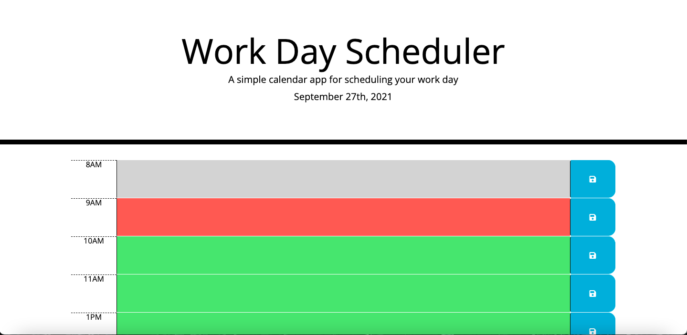
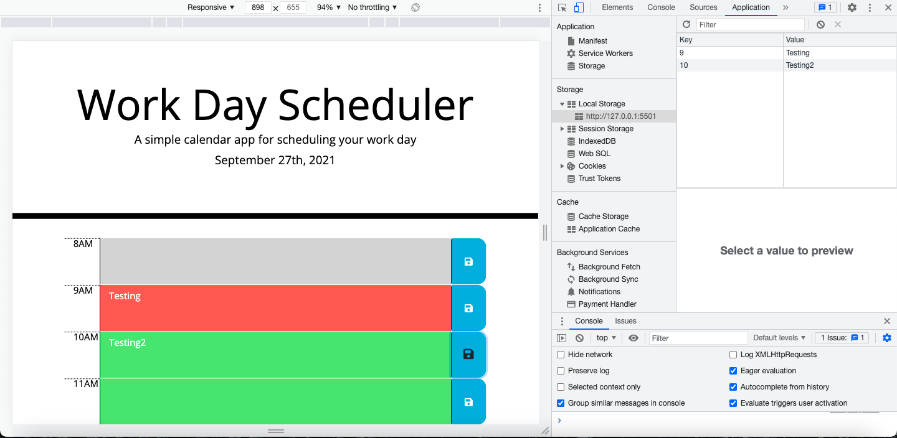

# Work_Day_Scheduler

## Description

- What was my motivation? I needed to create a calendar application that allowed a user to save events for each hour during the work day. I needed to display my knowledge of jQuery, Momentum.js, Font Awesome, and Bootstrap.
- Why did I build this project? I built this project to better understand how to implement Momentum.js and third-party APIs. I also needed practice using jQuery, Font Awesome, and Bootstrap.
- What problem does it solve? This project creates a calendar for a standard work day that saves events.
- What did I learn? I learned about Momentum.js, jQuery, Bootstrap, and Font Awesome.

## Table of Contents

- [Installation](#installation)
- [Usage](#usage)
- [Credits](#credits)
- [License](#license)
- [Links](#links)
- [Contact](#contact)

## Installation

Although this is simply a webpage and no installation is necessary, there were certain criteria that had to be met in order to complete this project:

    User Story

    AS AN employee with a busy schedule
    I WANT to add important events to a daily planner
    SO THAT I can manage my time effectively

    Acceptance Criteria

    GIVEN I am using a daily planner to create a schedule
    WHEN I open the planner
    THEN the current day is displayed at the top of the calendar
    WHEN I scroll down
    THEN I am presented with timeblocks for standard business hours
    WHEN I view the timeblocks for that day
    THEN each timeblock is color coded to indicate whether it is in the past, present, or future
    WHEN I click into a timeblock
    THEN I can enter an event
    WHEN I click the save button for that timeblock
    THEN the text for that event is saved in local storage
    WHEN I refresh the page
    THEN the saved events persist

## Usage

Please see below for examples of this webpage, which demonstrate its functionality:

### Color Code Functionality View

### Saved Data and Saved Local Storage View

## Credits

- https://momentjs.com/
- https://getbootstrap.com/
- https://fontawesome.com/
- https://blog.jquery.com/
- https://javascript.info/
- https://coding-boot-camp.github.io/full-stack/github/professional-readme-guide
- https://unsplash.com/

## License

© 2021 Trilogy Education Services, LLC, a 2U, Inc. brand. Confidential and Proprietary. All Rights Reserved.

## Links

[Live Link](https://carlincb.github.io/Work_Day_Scheduler/)

[GitHub Link](https://github.com/carlincb/Work_Day_Scheduler)

## Contact

Have questions? Please feel free to contact me at carlin.colleen@gmail.com.
